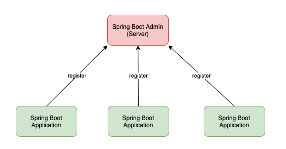

## Spring Boot Admin ##
Spring Boot Admin is a community project to manage and monitor your Spring Boot applications.
The applications register with our Spring Boot Admin Client (via HTTP) or are discovered using Spring Cloud.
The feature is just build on top of the Sprint Boot Actuator endpoints.

