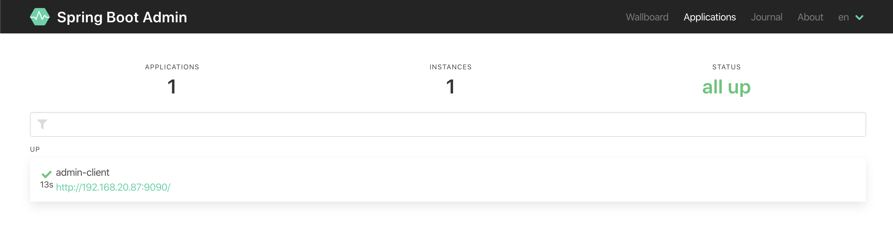
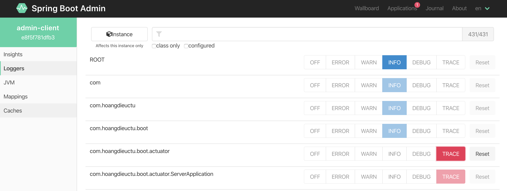

# Spring Boot Admin Client #
This is just a Spring Boot application. 
This create an endpoint for validate logging level is managed by Spring Boot Admin server.

# Code
```java
@RestController
@SpringBootApplication
public class ServerApplication {

    private static Logger logger = LoggerFactory.getLogger(ServerApplication.class);

    @GetMapping("/log")
    public void log() {
        logger.trace("TRACE message");
        logger.debug("DEBUG message");
        logger.info("INFO message");
        logger.warn("WARNING message");
        logger.error("ERROR message");
    }

    public static void main(String[] args) {
        SpringApplication.run(ServerApplication.class, args);
    }

}
```

# Dependencies
Add *spring-boot-admin-starter-client* and it required *spring-boot-starter-actuator*
```xml
<dependency>
    <groupId>org.springframework.boot</groupId>
    <artifactId>spring-boot-starter-actuator</artifactId>
</dependency>
<dependency>
    <groupId>de.codecentric</groupId>
    <artifactId>spring-boot-admin-starter-client</artifactId>
    <version>2.2.2</version>
</dependency>
```

# Config
Starting from Spring Boot 2.x, most of actuator endpoints are disabled by default.
Enable loggers actuator endpoints.

```yaml
management.endpoints.web.exposure.include=*
management.endpoint.health.show-details=always
```

Config the location of Spring Boot Admin server and the application name.
```yaml
spring.application.name=admin-client
spring.boot.admin.client.url=http://localhost:10010
```

Config server port
```yaml
server.port=9090
```

# Testing
*Starting Spring Boot Admin server and client*

Browser at: http://localhost:10010



Browser at: http://localhost:9090/log

*====>*
```
2020-03-24 06:41:13.324  INFO 38100 --- [nio-9090-exec-4] c.h.boot.actuator.ServerApplication      : INFO message
2020-03-24 06:41:13.325  WARN 38100 --- [nio-9090-exec-4] c.h.boot.actuator.ServerApplication      : WARNING message
2020-03-24 06:41:13.325 ERROR 38100 --- [nio-9090-exec-4] c.h.boot.actuator.ServerApplication      : ERROR message
```

**Change the logger level to TRACE**

*1. By using actuator endpoint:*
POST: http://localhost:9090/actuator/loggers/com.hoangdieuctu.boot.actuator
```json
{
  "configuredLevel": "TRACE"
}
```

*2. By using Spring Boot Admin server*



Browser at: http://localhost:8080/log

*====>*
```
2020-03-24 06:43:24.139 TRACE 38100 --- [nio-9090-exec-6] c.h.boot.actuator.ServerApplication      : TRACE message
2020-03-24 06:43:24.139 DEBUG 38100 --- [nio-9090-exec-6] c.h.boot.actuator.ServerApplication      : DEBUG message
2020-03-24 06:43:24.139  INFO 38100 --- [nio-9090-exec-6] c.h.boot.actuator.ServerApplication      : INFO message
2020-03-24 06:43:24.139  WARN 38100 --- [nio-9090-exec-6] c.h.boot.actuator.ServerApplication      : WARNING message
2020-03-24 06:43:24.139 ERROR 38100 --- [nio-9090-exec-6] c.h.boot.actuator.ServerApplication      : ERROR message
```