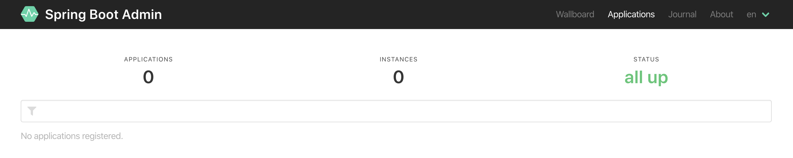
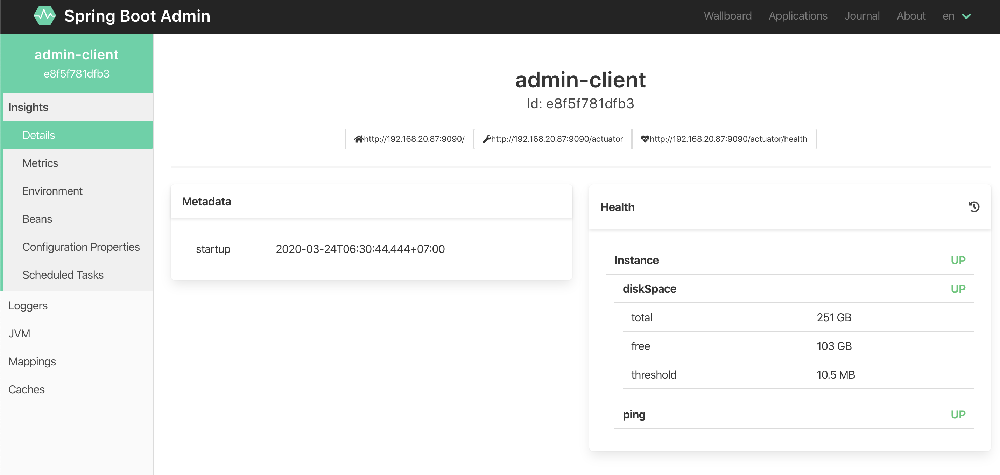

# Spring Boot Admin Server #
Spring Boot Admin Server is a web application, used for managing and monitoring Spring Boot applications. 
Each application is considered as a client and registers to the admin server. 
Behind the scenes, the magic is given by the Spring Boot Actuator endpoints.

# Code
Add the annotation *@EnableAdminServer*

```java
@EnableAdminServer
@SpringBootApplication
public class ServerApplication {

    public static void main(String[] args) {
        SpringApplication.run(ServerApplication.class, args);
    }

}
```

# Dependencies
Add *spring-boot-admin-starter-server*
```xml
<dependency>
    <groupId>de.codecentric</groupId>
    <artifactId>spring-boot-admin-starter-server</artifactId>
    <version>2.2.2</version>
</dependency>
```

# Config
```yaml
server.port=10010
```

# Testing

Browser at: http://localhost:10010



# More

With the Spring Boot Admin we can do lot of things.
